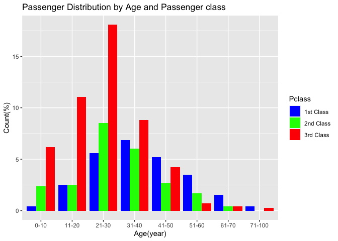

# Titanic - Machine Learning from Disaster

#### I will load and display the training dataset by library(readr)

## **Variable Notes**

### So, I have the prediction variable in numeric and categorical variables that explained below…

-   **Survival**: who was survived for 0 = No and 1 = Yes

-   **Sex**: Gender Male and female

-   **Pclass**: A proxy for socio-economic status (SES) 1st = Upper 2nd
    = Middle 3rd = Lower

-   **Age**: Age is fractional if less than 1. If the age is estimated,
    is it in the form of xx.5

-   **Sibsp**: The dataset defines family relations in this way…

Sibling : brother, sister, stepbrother, stepsister

Spouse :husband, wife (mistresses and fiancés were ignored)

-   **Parch**: The dataset defines family relations in this way…

Some children travelled only with a nanny, therefore parch=0 for them.

Parent : mother, father

Child : daughter, son, stepdaughter, stepson Some children travelled
only with a nanny, therefore parch=0 for them.

-   **Embarked** :Port of Embarkation C = Cherbourg, Q = Queenstown, S =
    Southampton

-   **Cabin** :Cabin number

#### At first, I will summarize the data

``` r
summary(titanic.train)
```

    ##   PassengerId       Survived          Pclass          Name          
    ##  Min.   :  1.0   Min.   :0.0000   Min.   :1.000   Length:891        
    ##  1st Qu.:223.5   1st Qu.:0.0000   1st Qu.:2.000   Class :character  
    ##  Median :446.0   Median :0.0000   Median :3.000   Mode  :character  
    ##  Mean   :446.0   Mean   :0.3838   Mean   :2.309                     
    ##  3rd Qu.:668.5   3rd Qu.:1.0000   3rd Qu.:3.000                     
    ##  Max.   :891.0   Max.   :1.0000   Max.   :3.000                     
    ##                                                                     
    ##      Sex                 Age            SibSp           Parch       
    ##  Length:891         Min.   : 0.42   Min.   :0.000   Min.   :0.0000  
    ##  Class :character   1st Qu.:20.12   1st Qu.:0.000   1st Qu.:0.0000  
    ##  Mode  :character   Median :28.00   Median :0.000   Median :0.0000  
    ##                     Mean   :29.70   Mean   :0.523   Mean   :0.3816  
    ##                     3rd Qu.:38.00   3rd Qu.:1.000   3rd Qu.:0.0000  
    ##                     Max.   :80.00   Max.   :8.000   Max.   :6.0000  
    ##                     NA's   :177                                     
    ##     Ticket               Fare           Cabin             Embarked        
    ##  Length:891         Min.   :  0.00   Length:891         Length:891        
    ##  Class :character   1st Qu.:  7.91   Class :character   Class :character  
    ##  Mode  :character   Median : 14.45   Mode  :character   Mode  :character  
    ##                     Mean   : 32.20                                        
    ##                     3rd Qu.: 31.00                                        
    ##                     Max.   :512.33                                        
    ## 

The summary shows the some numeric variables can do a distribution such
as Age, Fare and some of category variables are characters such as
Embarked, Sex, Cabin.Then some of the numeric variables are discrete
data such as Pclass, Survived,Parch, Sibsp. Finally,some variables just
show the information but it is not related to analyse the datasets are
Passenger Id, Ticket and Fare.

``` r
library(gtsummary)
```

    ## #BlackLivesMatter

``` r
titanic.train2 <- titanic.train %>% select(Age, Sex, Pclass, Embarked, Survived, SibSp, Parch)
titanic.train2 %>% 
  tbl_summary(by = Survived) %>%
  add_n()
```

<div id="ealoycbogh" style="padding-left:0px;padding-right:0px;padding-top:10px;padding-bottom:10px;overflow-x:auto;overflow-y:auto;width:auto;height:auto;">
<style>#ealoycbogh table {
  font-family: system-ui, 'Segoe UI', Roboto, Helvetica, Arial, sans-serif, 'Apple Color Emoji', 'Segoe UI Emoji', 'Segoe UI Symbol', 'Noto Color Emoji';
  -webkit-font-smoothing: antialiased;
  -moz-osx-font-smoothing: grayscale;
}

#ealoycbogh thead, #ealoycbogh tbody, #ealoycbogh tfoot, #ealoycbogh tr, #ealoycbogh td, #ealoycbogh th {
  border-style: none;
}

#ealoycbogh p {
  margin: 0;
  padding: 0;
}

#ealoycbogh .gt_table {
  display: table;
  border-collapse: collapse;
  line-height: normal;
  margin-left: auto;
  margin-right: auto;
  color: #333333;
  font-size: 16px;
  font-weight: normal;
  font-style: normal;
  background-color: #FFFFFF;
  width: auto;
  border-top-style: solid;
  border-top-width: 2px;
  border-top-color: #A8A8A8;
  border-right-style: none;
  border-right-width: 2px;
  border-right-color: #D3D3D3;
  border-bottom-style: solid;
  border-bottom-width: 2px;
  border-bottom-color: #A8A8A8;
  border-left-style: none;
  border-left-width: 2px;
  border-left-color: #D3D3D3;
}

#ealoycbogh .gt_caption {
  padding-top: 4px;
  padding-bottom: 4px;
}

#ealoycbogh .gt_title {
  color: #333333;
  font-size: 125%;
  font-weight: initial;
  padding-top: 4px;
  padding-bottom: 4px;
  padding-left: 5px;
  padding-right: 5px;
  border-bottom-color: #FFFFFF;
  border-bottom-width: 0;
}

#ealoycbogh .gt_subtitle {
  color: #333333;
  font-size: 85%;
  font-weight: initial;
  padding-top: 3px;
  padding-bottom: 5px;
  padding-left: 5px;
  padding-right: 5px;
  border-top-color: #FFFFFF;
  border-top-width: 0;
}

#ealoycbogh .gt_heading {
  background-color: #FFFFFF;
  text-align: center;
  border-bottom-color: #FFFFFF;
  border-left-style: none;
  border-left-width: 1px;
  border-left-color: #D3D3D3;
  border-right-style: none;
  border-right-width: 1px;
  border-right-color: #D3D3D3;
}

#ealoycbogh .gt_bottom_border {
  border-bottom-style: solid;
  border-bottom-width: 2px;
  border-bottom-color: #D3D3D3;
}

#ealoycbogh .gt_col_headings {
  border-top-style: solid;
  border-top-width: 2px;
  border-top-color: #D3D3D3;
  border-bottom-style: solid;
  border-bottom-width: 2px;
  border-bottom-color: #D3D3D3;
  border-left-style: none;
  border-left-width: 1px;
  border-left-color: #D3D3D3;
  border-right-style: none;
  border-right-width: 1px;
  border-right-color: #D3D3D3;
}

#ealoycbogh .gt_col_heading {
  color: #333333;
  background-color: #FFFFFF;
  font-size: 100%;
  font-weight: normal;
  text-transform: inherit;
  border-left-style: none;
  border-left-width: 1px;
  border-left-color: #D3D3D3;
  border-right-style: none;
  border-right-width: 1px;
  border-right-color: #D3D3D3;
  vertical-align: bottom;
  padding-top: 5px;
  padding-bottom: 6px;
  padding-left: 5px;
  padding-right: 5px;
  overflow-x: hidden;
}

#ealoycbogh .gt_column_spanner_outer {
  color: #333333;
  background-color: #FFFFFF;
  font-size: 100%;
  font-weight: normal;
  text-transform: inherit;
  padding-top: 0;
  padding-bottom: 0;
  padding-left: 4px;
  padding-right: 4px;
}

#ealoycbogh .gt_column_spanner_outer:first-child {
  padding-left: 0;
}

#ealoycbogh .gt_column_spanner_outer:last-child {
  padding-right: 0;
}

#ealoycbogh .gt_column_spanner {
  border-bottom-style: solid;
  border-bottom-width: 2px;
  border-bottom-color: #D3D3D3;
  vertical-align: bottom;
  padding-top: 5px;
  padding-bottom: 5px;
  overflow-x: hidden;
  display: inline-block;
  width: 100%;
}

#ealoycbogh .gt_spanner_row {
  border-bottom-style: hidden;
}

#ealoycbogh .gt_group_heading {
  padding-top: 8px;
  padding-bottom: 8px;
  padding-left: 5px;
  padding-right: 5px;
  color: #333333;
  background-color: #FFFFFF;
  font-size: 100%;
  font-weight: initial;
  text-transform: inherit;
  border-top-style: solid;
  border-top-width: 2px;
  border-top-color: #D3D3D3;
  border-bottom-style: solid;
  border-bottom-width: 2px;
  border-bottom-color: #D3D3D3;
  border-left-style: none;
  border-left-width: 1px;
  border-left-color: #D3D3D3;
  border-right-style: none;
  border-right-width: 1px;
  border-right-color: #D3D3D3;
  vertical-align: middle;
  text-align: left;
}

#ealoycbogh .gt_empty_group_heading {
  padding: 0.5px;
  color: #333333;
  background-color: #FFFFFF;
  font-size: 100%;
  font-weight: initial;
  border-top-style: solid;
  border-top-width: 2px;
  border-top-color: #D3D3D3;
  border-bottom-style: solid;
  border-bottom-width: 2px;
  border-bottom-color: #D3D3D3;
  vertical-align: middle;
}

#ealoycbogh .gt_from_md > :first-child {
  margin-top: 0;
}

#ealoycbogh .gt_from_md > :last-child {
  margin-bottom: 0;
}

#ealoycbogh .gt_row {
  padding-top: 8px;
  padding-bottom: 8px;
  padding-left: 5px;
  padding-right: 5px;
  margin: 10px;
  border-top-style: solid;
  border-top-width: 1px;
  border-top-color: #D3D3D3;
  border-left-style: none;
  border-left-width: 1px;
  border-left-color: #D3D3D3;
  border-right-style: none;
  border-right-width: 1px;
  border-right-color: #D3D3D3;
  vertical-align: middle;
  overflow-x: hidden;
}

#ealoycbogh .gt_stub {
  color: #333333;
  background-color: #FFFFFF;
  font-size: 100%;
  font-weight: initial;
  text-transform: inherit;
  border-right-style: solid;
  border-right-width: 2px;
  border-right-color: #D3D3D3;
  padding-left: 5px;
  padding-right: 5px;
}

#ealoycbogh .gt_stub_row_group {
  color: #333333;
  background-color: #FFFFFF;
  font-size: 100%;
  font-weight: initial;
  text-transform: inherit;
  border-right-style: solid;
  border-right-width: 2px;
  border-right-color: #D3D3D3;
  padding-left: 5px;
  padding-right: 5px;
  vertical-align: top;
}

#ealoycbogh .gt_row_group_first td {
  border-top-width: 2px;
}

#ealoycbogh .gt_row_group_first th {
  border-top-width: 2px;
}

#ealoycbogh .gt_summary_row {
  color: #333333;
  background-color: #FFFFFF;
  text-transform: inherit;
  padding-top: 8px;
  padding-bottom: 8px;
  padding-left: 5px;
  padding-right: 5px;
}

#ealoycbogh .gt_first_summary_row {
  border-top-style: solid;
  border-top-color: #D3D3D3;
}

#ealoycbogh .gt_first_summary_row.thick {
  border-top-width: 2px;
}

#ealoycbogh .gt_last_summary_row {
  padding-top: 8px;
  padding-bottom: 8px;
  padding-left: 5px;
  padding-right: 5px;
  border-bottom-style: solid;
  border-bottom-width: 2px;
  border-bottom-color: #D3D3D3;
}

#ealoycbogh .gt_grand_summary_row {
  color: #333333;
  background-color: #FFFFFF;
  text-transform: inherit;
  padding-top: 8px;
  padding-bottom: 8px;
  padding-left: 5px;
  padding-right: 5px;
}

#ealoycbogh .gt_first_grand_summary_row {
  padding-top: 8px;
  padding-bottom: 8px;
  padding-left: 5px;
  padding-right: 5px;
  border-top-style: double;
  border-top-width: 6px;
  border-top-color: #D3D3D3;
}

#ealoycbogh .gt_last_grand_summary_row_top {
  padding-top: 8px;
  padding-bottom: 8px;
  padding-left: 5px;
  padding-right: 5px;
  border-bottom-style: double;
  border-bottom-width: 6px;
  border-bottom-color: #D3D3D3;
}

#ealoycbogh .gt_striped {
  background-color: rgba(128, 128, 128, 0.05);
}

#ealoycbogh .gt_table_body {
  border-top-style: solid;
  border-top-width: 2px;
  border-top-color: #D3D3D3;
  border-bottom-style: solid;
  border-bottom-width: 2px;
  border-bottom-color: #D3D3D3;
}

#ealoycbogh .gt_footnotes {
  color: #333333;
  background-color: #FFFFFF;
  border-bottom-style: none;
  border-bottom-width: 2px;
  border-bottom-color: #D3D3D3;
  border-left-style: none;
  border-left-width: 2px;
  border-left-color: #D3D3D3;
  border-right-style: none;
  border-right-width: 2px;
  border-right-color: #D3D3D3;
}

#ealoycbogh .gt_footnote {
  margin: 0px;
  font-size: 90%;
  padding-top: 4px;
  padding-bottom: 4px;
  padding-left: 5px;
  padding-right: 5px;
}

#ealoycbogh .gt_sourcenotes {
  color: #333333;
  background-color: #FFFFFF;
  border-bottom-style: none;
  border-bottom-width: 2px;
  border-bottom-color: #D3D3D3;
  border-left-style: none;
  border-left-width: 2px;
  border-left-color: #D3D3D3;
  border-right-style: none;
  border-right-width: 2px;
  border-right-color: #D3D3D3;
}

#ealoycbogh .gt_sourcenote {
  font-size: 90%;
  padding-top: 4px;
  padding-bottom: 4px;
  padding-left: 5px;
  padding-right: 5px;
}

#ealoycbogh .gt_left {
  text-align: left;
}

#ealoycbogh .gt_center {
  text-align: center;
}

#ealoycbogh .gt_right {
  text-align: right;
  font-variant-numeric: tabular-nums;
}

#ealoycbogh .gt_font_normal {
  font-weight: normal;
}

#ealoycbogh .gt_font_bold {
  font-weight: bold;
}

#ealoycbogh .gt_font_italic {
  font-style: italic;
}

#ealoycbogh .gt_super {
  font-size: 65%;
}

#ealoycbogh .gt_footnote_marks {
  font-size: 75%;
  vertical-align: 0.4em;
  position: initial;
}

#ealoycbogh .gt_asterisk {
  font-size: 100%;
  vertical-align: 0;
}

#ealoycbogh .gt_indent_1 {
  text-indent: 5px;
}

#ealoycbogh .gt_indent_2 {
  text-indent: 10px;
}

#ealoycbogh .gt_indent_3 {
  text-indent: 15px;
}

#ealoycbogh .gt_indent_4 {
  text-indent: 20px;
}

#ealoycbogh .gt_indent_5 {
  text-indent: 25px;
}
</style>
<table class="gt_table" data-quarto-disable-processing="false" data-quarto-bootstrap="false">
  <thead>
    
    <tr class="gt_col_headings">
      <th class="gt_col_heading gt_columns_bottom_border gt_left" rowspan="1" colspan="1" scope="col" id="&lt;strong&gt;Characteristic&lt;/strong&gt;"><strong>Characteristic</strong></th>
      <th class="gt_col_heading gt_columns_bottom_border gt_center" rowspan="1" colspan="1" scope="col" id="&lt;strong&gt;N&lt;/strong&gt;"><strong>N</strong></th>
      <th class="gt_col_heading gt_columns_bottom_border gt_center" rowspan="1" colspan="1" scope="col" id="&lt;strong&gt;0&lt;/strong&gt;, N = 549&lt;span class=&quot;gt_footnote_marks&quot; style=&quot;white-space:nowrap;font-style:italic;font-weight:normal;&quot;&gt;&lt;sup&gt;1&lt;/sup&gt;&lt;/span&gt;"><strong>0</strong>, N = 549<span class="gt_footnote_marks" style="white-space:nowrap;font-style:italic;font-weight:normal;"><sup>1</sup></span></th>
      <th class="gt_col_heading gt_columns_bottom_border gt_center" rowspan="1" colspan="1" scope="col" id="&lt;strong&gt;1&lt;/strong&gt;, N = 342&lt;span class=&quot;gt_footnote_marks&quot; style=&quot;white-space:nowrap;font-style:italic;font-weight:normal;&quot;&gt;&lt;sup&gt;1&lt;/sup&gt;&lt;/span&gt;"><strong>1</strong>, N = 342<span class="gt_footnote_marks" style="white-space:nowrap;font-style:italic;font-weight:normal;"><sup>1</sup></span></th>
    </tr>
  </thead>
  <tbody class="gt_table_body">
    <tr><td headers="label" class="gt_row gt_left">Age</td>
<td headers="n" class="gt_row gt_center">714</td>
<td headers="stat_1" class="gt_row gt_center">28 (21, 39)</td>
<td headers="stat_2" class="gt_row gt_center">28 (19, 36)</td></tr>
    <tr><td headers="label" class="gt_row gt_left">    Unknown</td>
<td headers="n" class="gt_row gt_center"></td>
<td headers="stat_1" class="gt_row gt_center">125</td>
<td headers="stat_2" class="gt_row gt_center">52</td></tr>
    <tr><td headers="label" class="gt_row gt_left">Sex</td>
<td headers="n" class="gt_row gt_center">891</td>
<td headers="stat_1" class="gt_row gt_center"></td>
<td headers="stat_2" class="gt_row gt_center"></td></tr>
    <tr><td headers="label" class="gt_row gt_left">    female</td>
<td headers="n" class="gt_row gt_center"></td>
<td headers="stat_1" class="gt_row gt_center">81 (15%)</td>
<td headers="stat_2" class="gt_row gt_center">233 (68%)</td></tr>
    <tr><td headers="label" class="gt_row gt_left">    male</td>
<td headers="n" class="gt_row gt_center"></td>
<td headers="stat_1" class="gt_row gt_center">468 (85%)</td>
<td headers="stat_2" class="gt_row gt_center">109 (32%)</td></tr>
    <tr><td headers="label" class="gt_row gt_left">Pclass</td>
<td headers="n" class="gt_row gt_center">891</td>
<td headers="stat_1" class="gt_row gt_center"></td>
<td headers="stat_2" class="gt_row gt_center"></td></tr>
    <tr><td headers="label" class="gt_row gt_left">    1</td>
<td headers="n" class="gt_row gt_center"></td>
<td headers="stat_1" class="gt_row gt_center">80 (15%)</td>
<td headers="stat_2" class="gt_row gt_center">136 (40%)</td></tr>
    <tr><td headers="label" class="gt_row gt_left">    2</td>
<td headers="n" class="gt_row gt_center"></td>
<td headers="stat_1" class="gt_row gt_center">97 (18%)</td>
<td headers="stat_2" class="gt_row gt_center">87 (25%)</td></tr>
    <tr><td headers="label" class="gt_row gt_left">    3</td>
<td headers="n" class="gt_row gt_center"></td>
<td headers="stat_1" class="gt_row gt_center">372 (68%)</td>
<td headers="stat_2" class="gt_row gt_center">119 (35%)</td></tr>
    <tr><td headers="label" class="gt_row gt_left">Embarked</td>
<td headers="n" class="gt_row gt_center">889</td>
<td headers="stat_1" class="gt_row gt_center"></td>
<td headers="stat_2" class="gt_row gt_center"></td></tr>
    <tr><td headers="label" class="gt_row gt_left">    C</td>
<td headers="n" class="gt_row gt_center"></td>
<td headers="stat_1" class="gt_row gt_center">75 (14%)</td>
<td headers="stat_2" class="gt_row gt_center">93 (27%)</td></tr>
    <tr><td headers="label" class="gt_row gt_left">    Q</td>
<td headers="n" class="gt_row gt_center"></td>
<td headers="stat_1" class="gt_row gt_center">47 (8.6%)</td>
<td headers="stat_2" class="gt_row gt_center">30 (8.8%)</td></tr>
    <tr><td headers="label" class="gt_row gt_left">    S</td>
<td headers="n" class="gt_row gt_center"></td>
<td headers="stat_1" class="gt_row gt_center">427 (78%)</td>
<td headers="stat_2" class="gt_row gt_center">217 (64%)</td></tr>
    <tr><td headers="label" class="gt_row gt_left">    Unknown</td>
<td headers="n" class="gt_row gt_center"></td>
<td headers="stat_1" class="gt_row gt_center">0</td>
<td headers="stat_2" class="gt_row gt_center">2</td></tr>
    <tr><td headers="label" class="gt_row gt_left">SibSp</td>
<td headers="n" class="gt_row gt_center">891</td>
<td headers="stat_1" class="gt_row gt_center"></td>
<td headers="stat_2" class="gt_row gt_center"></td></tr>
    <tr><td headers="label" class="gt_row gt_left">    0</td>
<td headers="n" class="gt_row gt_center"></td>
<td headers="stat_1" class="gt_row gt_center">398 (72%)</td>
<td headers="stat_2" class="gt_row gt_center">210 (61%)</td></tr>
    <tr><td headers="label" class="gt_row gt_left">    1</td>
<td headers="n" class="gt_row gt_center"></td>
<td headers="stat_1" class="gt_row gt_center">97 (18%)</td>
<td headers="stat_2" class="gt_row gt_center">112 (33%)</td></tr>
    <tr><td headers="label" class="gt_row gt_left">    2</td>
<td headers="n" class="gt_row gt_center"></td>
<td headers="stat_1" class="gt_row gt_center">15 (2.7%)</td>
<td headers="stat_2" class="gt_row gt_center">13 (3.8%)</td></tr>
    <tr><td headers="label" class="gt_row gt_left">    3</td>
<td headers="n" class="gt_row gt_center"></td>
<td headers="stat_1" class="gt_row gt_center">12 (2.2%)</td>
<td headers="stat_2" class="gt_row gt_center">4 (1.2%)</td></tr>
    <tr><td headers="label" class="gt_row gt_left">    4</td>
<td headers="n" class="gt_row gt_center"></td>
<td headers="stat_1" class="gt_row gt_center">15 (2.7%)</td>
<td headers="stat_2" class="gt_row gt_center">3 (0.9%)</td></tr>
    <tr><td headers="label" class="gt_row gt_left">    5</td>
<td headers="n" class="gt_row gt_center"></td>
<td headers="stat_1" class="gt_row gt_center">5 (0.9%)</td>
<td headers="stat_2" class="gt_row gt_center">0 (0%)</td></tr>
    <tr><td headers="label" class="gt_row gt_left">    8</td>
<td headers="n" class="gt_row gt_center"></td>
<td headers="stat_1" class="gt_row gt_center">7 (1.3%)</td>
<td headers="stat_2" class="gt_row gt_center">0 (0%)</td></tr>
    <tr><td headers="label" class="gt_row gt_left">Parch</td>
<td headers="n" class="gt_row gt_center">891</td>
<td headers="stat_1" class="gt_row gt_center"></td>
<td headers="stat_2" class="gt_row gt_center"></td></tr>
    <tr><td headers="label" class="gt_row gt_left">    0</td>
<td headers="n" class="gt_row gt_center"></td>
<td headers="stat_1" class="gt_row gt_center">445 (81%)</td>
<td headers="stat_2" class="gt_row gt_center">233 (68%)</td></tr>
    <tr><td headers="label" class="gt_row gt_left">    1</td>
<td headers="n" class="gt_row gt_center"></td>
<td headers="stat_1" class="gt_row gt_center">53 (9.7%)</td>
<td headers="stat_2" class="gt_row gt_center">65 (19%)</td></tr>
    <tr><td headers="label" class="gt_row gt_left">    2</td>
<td headers="n" class="gt_row gt_center"></td>
<td headers="stat_1" class="gt_row gt_center">40 (7.3%)</td>
<td headers="stat_2" class="gt_row gt_center">40 (12%)</td></tr>
    <tr><td headers="label" class="gt_row gt_left">    3</td>
<td headers="n" class="gt_row gt_center"></td>
<td headers="stat_1" class="gt_row gt_center">2 (0.4%)</td>
<td headers="stat_2" class="gt_row gt_center">3 (0.9%)</td></tr>
    <tr><td headers="label" class="gt_row gt_left">    4</td>
<td headers="n" class="gt_row gt_center"></td>
<td headers="stat_1" class="gt_row gt_center">4 (0.7%)</td>
<td headers="stat_2" class="gt_row gt_center">0 (0%)</td></tr>
    <tr><td headers="label" class="gt_row gt_left">    5</td>
<td headers="n" class="gt_row gt_center"></td>
<td headers="stat_1" class="gt_row gt_center">4 (0.7%)</td>
<td headers="stat_2" class="gt_row gt_center">1 (0.3%)</td></tr>
    <tr><td headers="label" class="gt_row gt_left">    6</td>
<td headers="n" class="gt_row gt_center"></td>
<td headers="stat_1" class="gt_row gt_center">1 (0.2%)</td>
<td headers="stat_2" class="gt_row gt_center">0 (0%)</td></tr>
  </tbody>
  
  <tfoot class="gt_footnotes">
    <tr>
      <td class="gt_footnote" colspan="4"><span class="gt_footnote_marks" style="white-space:nowrap;font-style:italic;font-weight:normal;"><sup>1</sup></span> Median (IQR); n (%)</td>
    </tr>
  </tfoot>
</table>
</div>

**From the table 1.1 above**,the original Titanic datasets has been
modified to include a subset of variables, including Age, Sex, Passenger
Class, Port of Embarkation, Survival status, SibSp (Siblings/Spouses),
and Parch (Parents/Children). The table is divided into two sections
based on the “Survived” variable: one for passengers who survived ( = 1)
and another for passengers who did not survive ( = 0) that shows in the
count and percentages.

#### I will do the description by library(dplyr) to explain statistical analysis

``` r
library(dplyr)
```

    ## 
    ## Attaching package: 'dplyr'

    ## The following objects are masked from 'package:stats':
    ## 
    ##     filter, lag

    ## The following objects are masked from 'package:base':
    ## 
    ##     intersect, setdiff, setequal, union

``` r
titanic.trainsummary <- titanic.train %>%
  group_by(Pclass) %>%
  summarize(
    Observations = n(),
    Min = min(Age, na.rm = TRUE),
    Max = max(Age, na.rm = TRUE),
    Mean = mean(Age, na.rm = TRUE),
    Median = median(Age, na.rm = TRUE),
    SD = sd(Age, na.rm = TRUE)
  )
titanic.trainsummary
```

    ## # A tibble: 3 × 7
    ##   Pclass Observations   Min   Max  Mean Median    SD
    ##    <dbl>        <int> <dbl> <dbl> <dbl>  <dbl> <dbl>
    ## 1      1          216  0.92    80  38.2     37  14.8
    ## 2      2          184  0.67    70  29.9     29  14.0
    ## 3      3          491  0.42    74  25.1     24  12.5

**From the table1.2 above** shows The Passenger in the 1st class has the
oldest age about (38.23 +- 14.80) and The Passenger in the 3rd class has
the youngest age about (25.14 +- 12.49). Minimum of the age is in the
3rd class about 0.42 years old and Maximum of the age is in the 1st
class about 80 years old.

``` r
library(dplyr)
titanic.trainsummary <- titanic.train %>%
  group_by(Sex) %>%
  summarize(
    Observations = n(),
    Min = min(Age, na.rm = TRUE),
    Max = max(Age, na.rm = TRUE),
    Mean = mean(Age, na.rm = TRUE),
    Median = median(Age, na.rm = TRUE),
    SD = sd(Age, na.rm = TRUE)
  )
titanic.trainsummary
```

    ## # A tibble: 2 × 7
    ##   Sex    Observations   Min   Max  Mean Median    SD
    ##   <chr>         <int> <dbl> <dbl> <dbl>  <dbl> <dbl>
    ## 1 female          314  0.75    63  27.9     27  14.1
    ## 2 male            577  0.42    80  30.7     29  14.7

**From the table1.3 above** shows male are older age than female (30.72
+- 14.80) and female are younger age than male about (27.91 +- 14.11).
Minimum and maximum of the age is male about 0.42 and 80 years old.

``` r
library(dplyr)
titanic.trainsummary <- titanic.train %>%
  group_by(Embarked) %>%
  summarize(
     Observations = n(),
    Min = min(Age, na.rm = TRUE),
    Max = max(Age, na.rm = TRUE),
    Mean = mean(Age, na.rm = TRUE),
    Median = median(Age, na.rm = TRUE),
    SD = sd(Age, na.rm = TRUE)
  )
titanic.trainsummary
```

    ## # A tibble: 4 × 7
    ##   Embarked Observations   Min   Max  Mean Median    SD
    ##   <chr>           <int> <dbl> <dbl> <dbl>  <dbl> <dbl>
    ## 1 C                 168  0.42  71    30.8     29  15.4
    ## 2 Q                  77  2     70.5  28.1     27  16.9
    ## 3 S                 644  0.67  80    29.4     28  14.1
    ## 4 <NA>                2 38     62    50       50  17.0

**From the table1.4 above** shows who was embarked from Cherbourg has
the oldest age about (30.72 +- 14.80) and who was embarked from
Queenstown the youngest age about (28.08 +- 16.91). Minimum of the age
about 0.42 years old was embarked from Cherbourg and Maximum of the age
about 80 years old was embarked from the Southampton. 2 passengers are
not applicable.

``` r
library(dplyr)
titanic.trainsummary <- titanic.train %>%
  group_by(Survived) %>%
  summarize(
     Observations = n(),
    Min = min(Age, na.rm = TRUE),
    Max = max(Age, na.rm = TRUE),
    Mean = mean(Age, na.rm = TRUE),
    Median = median(Age, na.rm = TRUE),
    SD = sd(Age, na.rm = TRUE)
  )
titanic.trainsummary
```

    ## # A tibble: 2 × 7
    ##   Survived Observations   Min   Max  Mean Median    SD
    ##      <dbl>        <int> <dbl> <dbl> <dbl>  <dbl> <dbl>
    ## 1        0          549  1       74  30.6     28  14.2
    ## 2        1          342  0.42    80  28.3     28  15.0

**From the table 1.5 above**, shows was not survived has the older age
than who was survived (30.62 +- 14.17) and who was suvived has the
younger than age about (28.34 +- 14.95).

## **How do the features ‘Age’, ‘Sex’, ‘Embarked’,‘Sibsp’ and ‘Parch’ affect the chance of a passenger’s survival?**

#### I will do the description by library(ggplot2) to explain in a bar graph to tell more about count of each category of the feature with information about the percentage or counts and box plot to tell about the range of distribution of the feature.

``` r
table(titanic.train$Sex, titanic.train$Pclass)
```

    ##         
    ##            1   2   3
    ##   female  94  76 144
    ##   male   122 108 347

``` r
prop.table(table(titanic.train$Sex, titanic.train$Pclass))*100
```

    ##         
    ##                  1         2         3
    ##   female 10.549944  8.529742 16.161616
    ##   male   13.692480 12.121212 38.945006

``` r
library(ggplot2)
count_table <- prop.table(table(titanic.train$Sex, titanic.train$Pclass))*100
count_df <- as.data.frame(count_table)
colnames(count_df) <- c("Sex", "Pclass", "Count")
ggplot(count_df, aes(x = Sex, y = Count, fill = factor(Pclass))) +
  geom_bar(stat = "identity", position = "dodge") +
  labs(title = "Passenger Distribution by Gender and Passenger class",
       x = "Gender",
       y = "Count(%)") +
  scale_fill_manual(values = c("1" = "blue", "2" = "green", "3" = "red"),
                    labels = c("1st Class", "2nd Class", "3rd Class"),
                    name = "Pclass")
```


**From graph 2.1 above,** Shows the male in the 3rd class are the most
passenger in the titanic sorted by Gender and Class in percentage about
38.94% and female in the 2nd class is the least passenger about 8.52%

``` r
table(titanic.train$Sex, titanic.train$Embarked)
```

    ##         
    ##            C   Q   S
    ##   female  73  36 203
    ##   male    95  41 441

``` r
prop.table(table(titanic.train$Sex, titanic.train$Embarked))*100
```

    ##         
    ##                  C         Q         S
    ##   female  8.211474  4.049494 22.834646
    ##   male   10.686164  4.611924 49.606299

``` r
library(ggplot2)
count_table <- prop.table(table(titanic.train$Sex, titanic.train$Embarked))*100
count_df <- as.data.frame(count_table)
colnames(count_df) <- c("Sex", "Embarked", "Count")

ggplot(count_df, aes(x = Sex, y = Count, fill = factor(Embarked))) +
  geom_bar(stat = "identity", position = "dodge") +
  labs(title = "Passenger Distribution by Gender and Embarktation",
       x = "Gender",
       y = "Count(%)") +
  scale_fill_manual(values = c("C" = "blue", "Q" = "green", "S" = "red"),
                    labels = c("Cherbourg", "Queenstown", "Southampton"),
                    name = "Embarked")
```


**From graph 2.2 above**, Shows the male who was embarked at Southampton
are the most passenger in the titanic sorted by Gender and Embarked in
percentage about 49.60%

``` r
table(titanic.train$Sex, titanic.train$Survived)
```

    ##         
    ##            0   1
    ##   female  81 233
    ##   male   468 109

``` r
prop.table(table(titanic.train$Sex, titanic.train$Survived))*100
```

    ##         
    ##                  0         1
    ##   female  9.090909 26.150393
    ##   male   52.525253 12.233446

``` r
library(ggplot2)
count_table <- prop.table(table(titanic.train$Sex, titanic.train$Survived))*100
count_df <- as.data.frame(count_table)
colnames(count_df) <- c("Sex", "Survived", "Count")

ggplot(count_df, aes(x = Sex, y = Count, fill = factor(Survived))) +
  geom_bar(stat = "identity", position = "dodge") +
  labs(title = "Survival Distribution by Gender",
       x = "Gender",
       y = "Count(%)") +
  scale_fill_manual(values = c("0" = "red", "1" = "green"),
                    labels = c("Not Survived", "Survived"),
                    name = "Survived")
```


**From graph 2.3 above**, Shows the percentage that female was survived
more than male from Titanic sorted by Gender about 26.15.%. Most of male
died about 52.52% .

``` r
table(titanic.train$Pclass, titanic.train$Survived)
```

    ##    
    ##       0   1
    ##   1  80 136
    ##   2  97  87
    ##   3 372 119

``` r
prop.table(table(titanic.train$Pclass, titanic.train$Survived))*100
```

    ##    
    ##             0         1
    ##   1  8.978676 15.263749
    ##   2 10.886644  9.764310
    ##   3 41.750842 13.355780

``` r
library(ggplot2)
count_table <- prop.table(table(titanic.train$Pclass, titanic.train$Survived))*100
count_df <- as.data.frame(count_table)
colnames(count_df) <- c("Pclass", "Survived", "Count")
ggplot(count_df, aes(x = factor(Pclass), y = Count, fill = factor(Survived))) +
  geom_bar(stat = "identity", position = "dodge") +
  labs(title = "Survival Distribution by Passenger Class",
       x = "Passenger Class",
       y = "Count(%)") +
  scale_fill_manual(values = c("0" = "red", "1" = "green"),
                    labels = c("Not Survived", "Survived"),
                    name = "Survived")
```


**From graph 2.4 above**, Shows the percentage that Class 1 was survived
more than Class2 and Class3 from Titanic sorted by Passenger class about
15.26% and the most of Class 3 died about 41.75%

``` r
table(titanic.train$Embarked, titanic.train$Survived)
```

    ##    
    ##       0   1
    ##   C  75  93
    ##   Q  47  30
    ##   S 427 217

``` r
prop.table(table(titanic.train$Embarked, titanic.train$Survived))*100
```

    ##    
    ##             0         1
    ##   C  8.436445 10.461192
    ##   Q  5.286839  3.374578
    ##   S 48.031496 24.409449

``` r
library(ggplot2)
count_table <- prop.table(table(titanic.train$Embarked, titanic.train$Survived))*100
count_df <- as.data.frame(count_table)
colnames(count_df) <- c("Embarked", "Survived", "Count")
ggplot(count_df, aes(x = Embarked, y = Count, fill = factor(Survived))) +
  geom_bar(stat = "identity", position = "dodge") +
  labs(title = "Survival Distribution by Port of Embarkation",
       x = "Port of Embarkation",
       y = "Count(%)") +
  scale_fill_manual(values = c("0" = "red", "1" = "green"),
                    labels = c("Not Survived", "Survived"),
                    name = "Survived")
```


**From graph 2.5 above,** Shows the percentage that who was embarked as
Southampton was survived more than Cherbourg and Queenstown from Titanic
sorted by Embarkation about 24.40% and most of them died about 48.03%

#### In the Age variables, I will separate the age year in to a range.

``` r
titanic.train$Child[titanic.train$Age<=10] <- '0-10'
```

    ## Warning: Unknown or uninitialised column: `Child`.

``` r
titanic.train$Child[titanic.train$Age>10 & titanic.train$Age <=20] <- '11-20'
titanic.train$Child[titanic.train$Age>20 & titanic.train$Age <=30] <- '21-30'
titanic.train$Child[titanic.train$Age>30 & titanic.train$Age <=40] <- '31-40'
titanic.train$Child[titanic.train$Age>40 & titanic.train$Age <=50] <- '41-50'
titanic.train$Child[titanic.train$Age>50 & titanic.train$Age <=60] <- '51-60'
titanic.train$Child[titanic.train$Age>60 & titanic.train$Age <=70] <- '61-70'
titanic.train$Child[titanic.train$Age>70] <- '71-100'

table(titanic.train$Child, titanic.train$Sex)
```

    ##         
    ##          female male
    ##   0-10       31   33
    ##   11-20      46   69
    ##   21-30      81  149
    ##   31-40      55  100
    ##   41-50      31   55
    ##   51-60      14   28
    ##   61-70       3   14
    ##   71-100      0    5

``` r
prop.table(table(titanic.train$Child, titanic.train$Sex))*100
```

    ##         
    ##              female       male
    ##   0-10    4.3417367  4.6218487
    ##   11-20   6.4425770  9.6638655
    ##   21-30  11.3445378 20.8683473
    ##   31-40   7.7030812 14.0056022
    ##   41-50   4.3417367  7.7030812
    ##   51-60   1.9607843  3.9215686
    ##   61-70   0.4201681  1.9607843
    ##   71-100  0.0000000  0.7002801

``` r
library(ggplot2)
count_table <- prop.table(table(titanic.train$Child, titanic.train$Sex))*100
count_df <- as.data.frame(count_table)
colnames(count_df) <- c("Age", "Sex", "Count")

ggplot(count_df, aes(x = Age, y = Count, fill = factor(Sex))) +
  geom_bar(stat = "identity", position = "dodge") +
  labs(title = "Passenger Distribution by Age and Gender",
       x = "Age(year)",
       y = "Count(%)") +
  scale_fill_manual(values = c("male" = "blue", "female" = "pink"),
                    name = "Sex")
```


**From graph 2.6 above**, Shows the range age of the passenger in
titanic sorted by Gender. The range about 21 -30 years old of male is
the most passenger in titanic about 20.86% and Most of female 11.34%

``` r
titanic.train$Child[titanic.train$Age<=10] <- '0-10'
titanic.train$Child[titanic.train$Age>10 & titanic.train$Age <=20] <- '11-20'
titanic.train$Child[titanic.train$Age>20 & titanic.train$Age <=30] <- '21-30'
titanic.train$Child[titanic.train$Age>30 & titanic.train$Age <=40] <- '31-40'
titanic.train$Child[titanic.train$Age>40 & titanic.train$Age <=50] <- '41-50'
titanic.train$Child[titanic.train$Age>50 & titanic.train$Age <=60] <- '51-60'
titanic.train$Child[titanic.train$Age>60 & titanic.train$Age <=70] <- '61-70'
titanic.train$Child[titanic.train$Age>70] <- '71-100'
table(titanic.train$Child, titanic.train$Pclass)
```

    ##         
    ##            1   2   3
    ##   0-10     3  17  44
    ##   11-20   18  18  79
    ##   21-30   40  61 129
    ##   31-40   49  43  63
    ##   41-50   37  19  30
    ##   51-60   25  12   5
    ##   61-70   11   3   3
    ##   71-100   3   0   2

``` r
prop.table(table(titanic.train$Child, titanic.train$Pclass))*100
```

    ##         
    ##                   1          2          3
    ##   0-10    0.4201681  2.3809524  6.1624650
    ##   11-20   2.5210084  2.5210084 11.0644258
    ##   21-30   5.6022409  8.5434174 18.0672269
    ##   31-40   6.8627451  6.0224090  8.8235294
    ##   41-50   5.1820728  2.6610644  4.2016807
    ##   51-60   3.5014006  1.6806723  0.7002801
    ##   61-70   1.5406162  0.4201681  0.4201681
    ##   71-100  0.4201681  0.0000000  0.2801120

``` r
library(ggplot2)
count_table <- prop.table(table(titanic.train$Child, titanic.train$Pclass))*100
count_df <- as.data.frame(count_table)
colnames(count_df) <- c("Age", "Pclass", "Count")
ggplot(count_df, aes(x = Age, y = Count, fill = factor(Pclass))) +
  geom_bar(stat = "identity", position = "dodge") +
  labs(title = "Passenger Distribution by Age and Passenger class",
       x = "Age(year)",
       y = "Count(%)") +
  scale_fill_manual(values = c("1" = "blue", "2" = "green", "3" = "red"),
                    labels = c("1st Class", "2nd Class", "3rd Class"),
                    name = "Pclass")
```



**From graph 2.7 above**, Shows the range age of the passenger in
titanic sorted by Class. The range of not applicable in 3rd class is the
most passenger in titanic about 18.06 %

``` r
titanic.train$Child[titanic.train$Age<=10] <- '0-10'
titanic.train$Child[titanic.train$Age>10 & titanic.train$Age <=20] <- '11-20'
titanic.train$Child[titanic.train$Age>20 & titanic.train$Age <=30] <- '21-30'
titanic.train$Child[titanic.train$Age>30 & titanic.train$Age <=40] <- '31-40'
titanic.train$Child[titanic.train$Age>40 & titanic.train$Age <=50] <- '41-50'
titanic.train$Child[titanic.train$Age>50 & titanic.train$Age <=60] <- '51-60'
titanic.train$Child[titanic.train$Age>60 & titanic.train$Age <=70] <- '61-70'
titanic.train$Child[titanic.train$Age>70] <- '71-100'
table(titanic.train$Child, titanic.train$Embarked)
```

    ##         
    ##            C   Q   S
    ##   0-10     9   4  51
    ##   11-20   23   6  86
    ##   21-30   42   6 182
    ##   31-40   25   7 122
    ##   41-50   16   2  68
    ##   51-60   12   1  29
    ##   61-70    1   1  14
    ##   71-100   2   1   2

``` r
prop.table(table(titanic.train$Child, titanic.train$Embarked))*100
```

    ##         
    ##                   C          Q          S
    ##   0-10    1.2640449  0.5617978  7.1629213
    ##   11-20   3.2303371  0.8426966 12.0786517
    ##   21-30   5.8988764  0.8426966 25.5617978
    ##   31-40   3.5112360  0.9831461 17.1348315
    ##   41-50   2.2471910  0.2808989  9.5505618
    ##   51-60   1.6853933  0.1404494  4.0730337
    ##   61-70   0.1404494  0.1404494  1.9662921
    ##   71-100  0.2808989  0.1404494  0.2808989

``` r
library(ggplot2)
count_table <- prop.table(table(titanic.train$Child, titanic.train$Embarked))*100
count_df <- as.data.frame(count_table)
colnames(count_df) <- c("Age", "Embarked", "Count")
ggplot(count_df, aes(x = Age, y = Count, fill = factor(Embarked))) +
  geom_bar(stat = "identity", position = "dodge") +
  labs(title = "Passenger Distribution by Age and Embarktation",
       x = "Age(year)",
       y = "Count(%)") +
  scale_fill_manual(values = c("C" = "blue", "Q" = "green", "S" = "red"),
                    labels = c("Cherbourg", "Queenstown", "Southampton"),
                    name = "Embarked")
```


**From graph 2.8 above**, Shows the range age of the passenger in
titanic sorted by Embarked. The range of 21-30 years old from
Southampton is the most passenger in titanic about 25.56%

``` r
titanic.train$Child[titanic.train$Age<=10] <- '0-10'
titanic.train$Child[titanic.train$Age>10 & titanic.train$Age <=20] <- '11-20'
titanic.train$Child[titanic.train$Age>20 & titanic.train$Age <=30] <- '21-30'
titanic.train$Child[titanic.train$Age>30 & titanic.train$Age <=40] <- '31-40'
titanic.train$Child[titanic.train$Age>40 & titanic.train$Age <=50] <- '41-50'
titanic.train$Child[titanic.train$Age>50 & titanic.train$Age <=60] <- '51-60'
titanic.train$Child[titanic.train$Age>60 & titanic.train$Age <=70] <- '61-70'
titanic.train$Child[titanic.train$Age>70] <- '71-100'
table(titanic.train$Child, titanic.train$Survived)
```

    ##         
    ##            0   1
    ##   0-10    26  38
    ##   11-20   71  44
    ##   21-30  146  84
    ##   31-40   86  69
    ##   41-50   53  33
    ##   51-60   25  17
    ##   61-70   13   4
    ##   71-100   4   1

``` r
prop.table(table(titanic.train$Child, titanic.train$Survived))*100
```

    ##         
    ##                   0          1
    ##   0-10    3.6414566  5.3221289
    ##   11-20   9.9439776  6.1624650
    ##   21-30  20.4481793 11.7647059
    ##   31-40  12.0448179  9.6638655
    ##   41-50   7.4229692  4.6218487
    ##   51-60   3.5014006  2.3809524
    ##   61-70   1.8207283  0.5602241
    ##   71-100  0.5602241  0.1400560

``` r
library(ggplot2)
count_table <- prop.table(table(titanic.train$Child, titanic.train$Survived))*100
count_df <- as.data.frame(count_table)
colnames(count_df) <- c("Age", "Survived", "Count")
ggplot(count_df, aes(x = Age, y = Count, fill = factor(Survived))) +
  geom_bar(stat = "identity", position = "dodge") +
  labs(title = "Survival Distribution by Age and Survival",
       x = "Age(year)",
       y = "Count(%)") +
  scale_fill_manual(values = c("0" = "red", "1" = "green"),
                    labels = c("Not Survived", "Survived"),
                    name = "Survived")
```


**From graph 2.9 above,** Shows the range age of the passenger in
titanic sorted by who was survived. The range of 21-30 years old was
survived the most about 11.76% and most of them died about 20.44%

``` r
table(titanic.train$SibSp, titanic.train$Survived)
```

    ##    
    ##       0   1
    ##   0 398 210
    ##   1  97 112
    ##   2  15  13
    ##   3  12   4
    ##   4  15   3
    ##   5   5   0
    ##   8   7   0

``` r
prop.table(table(titanic.train$SibSp, titanic.train$Survived))*100
```

    ##    
    ##              0          1
    ##   0 44.6689113 23.5690236
    ##   1 10.8866442 12.5701459
    ##   2  1.6835017  1.4590348
    ##   3  1.3468013  0.4489338
    ##   4  1.6835017  0.3367003
    ##   5  0.5611672  0.0000000
    ##   8  0.7856341  0.0000000

``` r
library(ggplot2)
count_table <- prop.table(table(titanic.train$SibSp, titanic.train$Survived))*100
count_df <- as.data.frame(count_table)
colnames(count_df) <- c("SibSp", "Survived", "Count")
ggplot(count_df, aes(x = SibSp, y = Count, fill = factor(Survived))) +
  geom_bar(stat = "identity", position = "dodge") +
  labs(title = "Survival Distribution by family relations(Siblings and spouse) ",
       x = "SibSp(Sibling and Spouse)",
       y = "Count(%)") +
  scale_fill_manual(values = c("0" = "red", "1" = "green"),
                    labels = c("Not Survived", "Survived"),
                    name = "Survived")
```


**From graph 2.10 above**, Shows the family relations(Siblings and
spouse) of the passenger in titanic sorted by who was survived. The
passenger who was not have a family relations was survived the most
about 23.56% and mostly of them died about 44.66%.

``` r
table(titanic.train$Parch, titanic.train$Survived)
```

    ##    
    ##       0   1
    ##   0 445 233
    ##   1  53  65
    ##   2  40  40
    ##   3   2   3
    ##   4   4   0
    ##   5   4   1
    ##   6   1   0

``` r
prop.table(table(titanic.train$Parch, titanic.train$Survived))*100
```

    ##    
    ##              0          1
    ##   0 49.9438833 26.1503928
    ##   1  5.9483726  7.2951740
    ##   2  4.4893378  4.4893378
    ##   3  0.2244669  0.3367003
    ##   4  0.4489338  0.0000000
    ##   5  0.4489338  0.1122334
    ##   6  0.1122334  0.0000000

``` r
library(ggplot2)
count_table <- prop.table(table(titanic.train$Parch, titanic.train$Survived))*100
count_df <- as.data.frame(count_table)
colnames(count_df) <- c("Parch", "Survived", "Count")
ggplot(count_df, aes(x = Parch, y = Count, fill = factor(Survived))) +
  geom_bar(stat = "identity", position = "dodge") +
  labs(title = "Survival Distribution by family relations(Parents and children) ",
       x = "Parch",
       y = "Count(%)") +
  scale_fill_manual(values = c("0" = "red", "1" = "green"),
                    labels = c("Not Survived", "Survived"),
                    name = "Survived")
```


**From graph 2.11 above**, Shows the family relations(Parents and
children) of the passenger in titanic sorted by who was survived. The
passenger who was not have a family relations was survived the most
about 26.15% and mostly of them died about 49.94%.

#### The boxplot tell about the range of distribution of the feature shows a skewed distribution which is contained

##### 1. Interquartile range (IQR): it is drawn as a rectangle between the first quartile (Q1) and the third quartile (Q3). The difference between the third quartile and first quartile known as the interquartile range = Q3-Q1

##### 2. Median: which is the middle value when the data is ordered

##### 3. Potential outliers: The extreme data is individual data points that fall beyond the whiskers of the boxplot marked to draw attention to their deviation from the central data distribution.

##### 4. Line (or Whisker): represents the range of the data outside the IQR. A common approach is to extend them to a minimum and maximum of 1.5 times the IQR beyond Q1 and Q3

##### Minimum: Q1 - 1.5\*IQR

##### Maximum: Q3 + 1.5\*IQR


``` r
library(ggplot2)
ggplot(titanic.train, aes(x = factor(Survived), y = Age, fill = factor(Survived))) +
  geom_boxplot() +
  labs(title = "Box Plot of Age and Survival Status",
       x = "Survived",
       y = "Age")+
  scale_x_discrete(labels = c("Not Survived", "Survived")) +
  scale_fill_manual(values = c("0" = "red", "1" = "green"),
                    labels = c("Not Survived", "Survived"),
                    name = "Survived")
```

    ## Warning: Removed 177 rows containing non-finite values (`stat_boxplot()`).


**From the graph3.1** above Shows the range of distribution between Age
and who was survived.

``` r
library(ggplot2)
ggplot(data = titanic.train, aes(x = factor(Pclass), y = Age, fill = factor(Survived))) +
  geom_boxplot() +
  labs(title = "Box Plot of Age by Passenger Class and Survival Status",
       x = "Passenger Class",
       y = "Age") +
  scale_x_discrete(labels = c("1st Class", "2nd Class", "3rd Class")) +
  scale_fill_manual(values = c("0" = "red", "1" = "green"),
                    labels = c("Not Survived", "Survived"),
                    name = "Survived")
```

    ## Warning: Removed 177 rows containing non-finite values (`stat_boxplot()`).


**From the graph3.2** above Shows the range of distribution between Age
and and Passenger class who was survived.

``` r
library(ggplot2)
ggplot(data = titanic.train, aes(x = factor(Embarked), y = Age, fill = factor(Survived))) +
  geom_boxplot() +
  labs(title = "Box Plot of Age by Embarkation and Survival Status",
       x = "Embarktation",
       y = "Age") +
  scale_x_discrete(labels = c("C", "S", "Q")) +
  scale_fill_manual(values = c("0" = "red", "1" = "green"),
                    labels = c("Not Survived", "Survived"),
                    name = "Survived")
```

    ## Warning: Removed 177 rows containing non-finite values (`stat_boxplot()`).


**From the graph3.3** above Shows the range of distribution between Age
and Embarkation and who was survived.

## References:

<https://rstudio-pubs-static.s3.amazonaws.com/143316_106d643df86c4e4c8ae20e9775ab0ec7.html>

<https://www.kaggle.com/competitions/titanic>

<https://www.danieldsjoberg.com/gtsummary/>

<https://www.r-bloggers.com/2016/02/titanic-machine-learning-from-disaster-part-1/>

<https://medium.com/analytics-vidhya/titanic-dataset-analysis-80-accuracy-9480cf3db538>

<https://byjus.com/maths/box-plot/>
